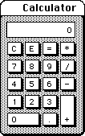

***

# WacOS BaSYS Subsystem calculator

## About

The BaSYS calculator is a basic calculator program for BaSYS 1-6 (but will still function up to Wac OS 9.5, and other systems that support Pascal)

It is a basic calculator, with monochrome colors, and an extremely basic interface. It is designed to replicate the calculator found in Apple System 1 to 6. It is written in Pascal.
 
## Links

### Software tracking repository

[See in BaSYS software tracking repository](https://github.com/seanpm2001/WacOS_BaSYS_Software#wacos-basys-software-portal)

### Home repositories

[Guesthouse repository](https://github.com/seanpm2001/WacOS_BaSYS_Software_Calculator/)

This is a guesthouse repository, and not a home repository, as development mainly stays on the main WacOS side. This is just the guesthouse that the project retreats to at times. If you are already in this repository, the link is likely recursive, and will reload the page.

[Home repository](https://github.com/seanpm2001/WacOS/tree/WacOS-dev/Programs/Legacy/BaSYS/Calculator/)

This is the home repository. If you are already in this repository, the link is likely recursive, and will reload the page.

***

## Feature translation notes

The exact system requirements are not a forced emulation option. The WacOS system is designed to be lighter, but you can adjust it to match MacOS.

WacOS equivalents of programs are included.

Malicious methods (such as DRM/TPM) are NEVER included with WacOS, not even as an open source recreation.

Please [raise an issue](https://github.com/seanpm2001/WacOS/issues/) if any other clarification is needed.

***

## File info

**File type:** `Markdown document (*.md *.mkd *.mdown *.markdown)`

**File version:** `1 (2022, Thursday, June 9th at 5:10 pm PST)`

**Line count (including blank lines and compiler line):** `55`

**Article language (current):** `English (USA)`

***
